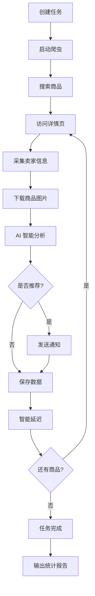

# 闲鱼智能监控机器人 - 项目介绍

> 🐟 一个基于 AI 驱动的智能闲鱼商品监控系统，支持自动搜索、AI 分析、实时通知

---

## 📋 目录

- [系统功能](#系统功能)
- [系统优势](#系统优势)
- [性能对比](#性能对比)
- [部署方法](#部署方法)
- [使用指南](#使用指南)
- [技术架构](#技术架构)

---

## 🎯 系统功能

### 核心功能

#### 1. 智能商品搜索与监控
- ✅ **关键词搜索**：支持任意关键词搜索闲鱼商品
- ✅ **价格筛选**：设置最低/最高价格范围
- ✅ **卖家筛选**：仅显示个人闲置卖家（排除商家）
- ✅ **多页采集**：支持采集多页商品信息
- ✅ **定时任务**：支持 Cron 表达式定时执行

#### 2. AI 智能分析
- ✅ **商品图片识别**：自动下载并分析商品图片
- ✅ **自然语言描述**：用自然语言描述购买需求
- ✅ **智能判断**：AI 自动判断是否推荐购买
- ✅ **详细分析**：提供详细的推荐理由和风险提示
- ✅ **支持多模型**：兼容 OpenAI 格式的 AI 模型（Qwen、GPT、Gemini 等）

#### 3. 卖家信息采集
- ✅ **卖家信用**：芝麻信用等级评估
- ✅ **注册时长**：卖家注册时间分析
- ✅ **商品列表**：卖家发布的所有商品
- ✅ **历史评价**：卖家收到的所有评价
- ✅ **信誉评分**：基于评价计算的信誉分数
- ✅ **智能缓存**：24小时缓存，避免重复采集

#### 4. 实时通知推送
支持多种通知渠道（可同时配置多个）：

- 📱 **企业微信机器人**：群聊通知
- 🔔 **钉钉机器人**：群聊通知
- 💬 **飞书机器人**：群聊通知
- 📲 **Gotify**：iOS/Android 推送
- 📬 **Bark**：iOS 专用推送
- 🔗 **通用 Webhook**：自定义通知服务

通知内容包括：
- 商品标题、价格、链接
- 卖家信息（信用、注册时长）
- AI 分析结果和推荐理由
- 商品图片预览

#### 5. Web 管理后台
- ✅ **任务管理**：创建、编辑、删除、启动/停止任务
- ✅ **实时日志**：查看运行日志和调试信息
- ✅ **结果查看**：查看已采集的商品数据
- ✅ **系统设置**：修改密码、登录状态、日志管理
- ✅ **登录认证**：安全的用户名密码认证
- ✅ **响应式设计**：支持桌面和移动设备

#### 6. 日志管理
- ✅ **日志统计**：查看日志文件数量和占用空间
- ✅ **一键清理**：按天数清理旧日志
- ✅ **自动保护**：保护当前日志文件不被删除

---

## 💡 系统优势

### 1. AI 驱动，智能决策
- 🤖 **多模态 AI**：支持图片+文本综合分析
- 📝 **自然语言**：用中文描述需求，无需复杂配置
- 🎯 **精准判断**：AI 综合商品图片、描述、价格、卖家信息等多维度判断
- 📊 **详细理由**：提供推荐或不推荐的详细理由

### 2. 稳定可靠，安全优先
- 🛡️ **自适应延迟**：根据成功率智能调整速度，避免风控
- 💾 **智能缓存**：避免重复采集，提升效率
- 🔒 **安全边界**：最小延迟5秒，最大延迟60秒
- 📉 **失败检测**：自动检测失败并增加延迟保护账户
- 🎭 **人性化行为**：模拟真实用户操作（滚动、随机延迟）

### 3. 高性能，智能优化
- ⚡ **速度提升 50-60%**：相比固定延迟模式
- 📦 **卖家缓存**：再次遇到同一卖家节省 15-30 秒
- 🚀 **动态调速**：稳定时提速，风控时降速
- 📈 **性能监控**：实时显示成功率、命中率等统计

### 4. 功能完善，易于使用
- 🖥️ **Web 界面**：无需命令行操作
- ⏰ **定时任务**：支持 Cron 表达式自动化
- 📱 **多端通知**：支持微信、钉钉、飞书等多种推送
- 🔧 **配置灵活**：支持代理池、无头模式等多种配置
- 📊 **数据持久化**：JSONL 格式存储，方便分析

### 5. 开箱即用，部署简单
- 🐳 **支持 Docker**：一键部署
- 📦 **依赖管理**：requirements.txt 自动安装
- 📖 **文档完善**：详细的部署和使用文档
- 🔧 **配置简单**：.env 文件集中配置
- 🚀 **快速启动**：3步即可运行

---

## 📊 性能对比

### 优化前 vs 优化后

#### 场景：爬取 3 页，60 个商品

| 指标 | 优化前（固定延迟） | 优化后（智能模式） | 提升 |
|------|-------------------|-------------------|------|
| **商品处理后延迟** | 20-40 秒 | 5-25 秒（自适应） | ⬇️ 37-75% |
| **翻页间延迟** | 30-60 秒 | 5-30 秒（自适应） | ⬇️ 50-83% |
| **卖家信息采集** | 每次都采集 | 缓存命中跳过 | ⬇️ 30-70% |
| **总耗时（普通情况）** | 40-60 分钟 | 15-25 分钟 | ⬆️ **50-60%** |
| **总耗时（高缓存命中）** | 40-60 分钟 | 12-18 分钟 | ⬆️ **60-70%** |
| **总耗时（无缓存命中）** | 40-60 分钟 | 20-30 分钟 | ⬆️ **40-50%** |

### 智能延迟调节示例

```
初始状态：延迟 15-25 秒
  ↓ (连续成功 3 次)
加速状态：延迟 12-20 秒（提速 20%）
  ↓ (继续稳定运行)
最优状态：延迟 8-15 秒（提速 40%）
  ↓ (遇到 1 次失败)
保护状态：延迟 15-30 秒（自动降速保护）
  ↓ (连续成功 3 次)
恢复状态：延迟 12-25 秒（自动恢复）
```

### 缓存效果示例

```
场景：60 个商品来自 20 个不同卖家

优化前：
  - 采集 60 次卖家信息 = 60 × 20秒 = 20 分钟

优化后：
  - 采集 20 次卖家信息 = 20 × 20秒 = 6.7 分钟
  - 40 次使用缓存 = 40 × 0.1秒 = 4 秒
  - 总计：6.7 分钟

节省时间：13.3 分钟（节省 66%）
```

---

## 🚀 部署方法

### 方法 1：本地部署（推荐新手）

#### 系统要求
- Windows 10/11 或 macOS 或 Linux
- Python 3.9+
- Chrome 或 Edge 浏览器

#### 部署步骤

**1. 安装 Python**
```bash
# Windows
# 下载并安装 Python 3.9+ from python.org

# macOS
brew install python@3.9

# Linux (Ubuntu/Debian)
sudo apt update
sudo apt install python3.9 python3-pip
```

**2. 克隆项目**
```bash
git clone <项目地址>
cd 闲鱼修改 备份（2）
```

**3. 安装依赖**
```bash
# 安装 Python 依赖
pip install -r requirements.txt

# 安装 Playwright 浏览器
python -m playwright install chromium
```

**4. 配置环境变量**
```bash
# 复制配置文件
cp .env.example .env

# 编辑 .env 文件，配置以下参数：
# - OPENAI_API_KEY（必填）：AI 模型 API Key
# - OPENAI_BASE_URL（必填）：AI 模型 API 地址
# - OPENAI_MODEL_NAME（必填）：模型名称，如 qwen-vl-plus
# - WX_BOT_URL（可选）：企业微信机器人 Webhook
# - WEB_USERNAME（默认：admin）
# - WEB_PASSWORD（默认：admin123）
```

**5. 获取闲鱼登录状态**

##### 方式 A：手动登录（推荐本地使用）
```bash
# 1. 设置 RUN_HEADLESS=false
# 2. 运行程序，会打开浏览器
# 3. 手动扫码登录闲鱼
# 4. 登录状态自动保存
```

##### 方式 B：使用浏览器扩展（推荐服务器使用）
```bash
# 1. 安装 Chrome 扩展
# https://chromewebstore.google.com/detail/xianyu-login-state-extrac/eidlpfegpigmfcahkmlenhppfklcoa

# 2. 打开 https://www.goofish.com 并登录

# 3. 点击扩展图标，提取登录状态

# 4. 复制 JSON 内容

# 5. 在 Web 管理后台 → 系统设置 → 手动更新登录状态，粘贴并保存
```

**6. 启动服务**
```bash
# 启动 Web 服务器
python web_server.py

# 访问 http://127.0.0.1:8000
# 默认用户名：admin
# 默认密码：admin123
```

---

### 方法 2：Docker 部署（推荐服务器）

#### 系统要求
- Docker 20.10+
- Docker Compose 1.29+

#### 部署步骤

**1. 使用 Docker Compose（推荐）**

```bash
# 1. 克隆项目
git clone <项目地址>
cd 闲鱼修改 备份（2）

# 2. 构建并启动
docker-compose up -d

# 3. 查看日志
docker-compose logs -f

# 4. 访问
# http://你的服务器IP:8000
```

**2. 使用 Docker 命令**

```bash
# 1. 构建镜像
docker build -t xianyu-monitor .

# 2. 运行容器
docker run -d \
  --name xianyu-monitor \
  -p 8000:8000 \
  -v $(pwd)/jsonl:/app/jsonl \
  -v $(pwd)/logs:/app/logs \
  -v $(pwd)/.env:/app/.env \
  xianyu-monitor

# 3. 查看日志
docker logs -f xianyu-monitor
```

---

### 方法 3：Anaconda 部署（推荐科学计算环境）

#### 部署步骤

```bash
# 1. 安装 Anaconda
# https://www.anaconda.com/products/distribution

# 2. 创建虚拟环境
conda create -n xianyu python=3.9

# 3. 激活环境
conda activate xianyu

# 4. 安装依赖
pip install -r requirements.txt
python -m playwright install chromium

# 5. 配置并启动（同方法 1 的步骤 4-6）
```

---

## 📖 使用指南

### 快速开始

#### 1. 创建监控任务

1. 登录 Web 管理后台
2. 点击 **"创建新任务"**
3. 填写任务信息：
   - **任务名称**：如 "MacBook Pro 监控"
   - **搜索关键词**：如 "MacBook Pro M2"
   - **价格范围**：最低价 5000，最高价 12000
   - **最大搜索页数**：3 页
   - **定时执行**：如 `0 */2 * * *`（每2小时执行一次）
   - **详细购买需求**：用自然语言描述，如：
     ```
     我想买一台95新以上的MacBook Pro M2，预算在8000到12000元之间，
     快门数要低于5000。必须是国行且配件齐全。优先考虑个人卖家，
     不需要专业卖家。内存至少16GB，存储空间至少512GB。
     ```
   - **仅筛选个人闲置**：勾选

4. 点击 **"创建任务"**

#### 2. 查看结果

- 点击 **"结果查看"**
- 选择结果文件（JSONL 格式）
- 查看已采集的商品数据
- 可以下载或删除文件

#### 3. 查看日志

- 点击 **"运行日志"**
- 实时查看爬虫运行状态
- 查看 AI 分析过程
- 调试问题

#### 4. 系统设置

- **修改密码**：建议首次登录后修改
- **手动更新登录状态**：使用浏览器扩展更新登录凭证
- **日志管理**：清理旧日志释放空间

---

## 🏗️ 技术架构

### 技术栈

| 层级 | 技术栈 | 说明 |
|------|--------|------|
| **后端框架** | FastAPI | 高性能 Python Web 框架 |
| **爬虫引擎** | Playwright | 浏览器自动化工具 |
| **AI 模型** | OpenAI API | 兼容 OpenAI 格式的 AI 模型 |
| **数据存储** | JSONL | JSON Lines 格式存储 |
| **Web 前端** | 原生 JavaScript + CSS | 轻量级前端 |
| **异步处理** | asyncio | Python 异步编程 |
| **定时任务** | APScheduler | Python 定时任务库 |

### 项目结构

```
闲鱼修改 备份（2）/
├── src/                      # 源代码目录
│   ├── scraper.py           # 爬虫核心模块
│   ├── ai_handler.py        # AI 分析模块
│   ├── parsers.py           # 数据解析模块
│   ├── adaptive_delay.py    # 性能优化模块
│   ├── config.py            # 配置管理
│   ├── proxy_pool.py        # 代理池管理
│   └── utils.py             # 工具函数
├── static/                   # 静态资源
│   ├── css/                 # 样式文件
│   └── js/                  # JavaScript 文件
├── templates/                # HTML 模板
│   ├── index.html           # 主页面
│   └── login.html           # 登录页面
├── jsonl/                    # 数据存储目录
├── logs/                     # 日志目录
├── web_server.py            # Web 服务器
├── .env                     # 配置文件
├── requirements.txt          # Python 依赖
├── Dockerfile               # Docker 镜像
├── docker-compose.yml       # Docker Compose 配置
└── 性能优化说明.md          # 优化说明文档
```

### 工作流程



---

## 🎓 最佳实践

### 1. 任务配置建议

**搜索关键词**：
- ✅ 具体：如 "iPhone 14 Pro 256G" 而不是 "手机"
- ✅ 包含型号：如 "MacBook Pro M2" 而不是 "MacBook"

**价格范围**：
- ✅ 合理范围：避免过宽，如 "1000-10000"
- ✅ 留有余地：考虑市场价波动，如预算 5000，设置 4000-6000

**详细购买需求**：
- ✅ 具体明确：说明新旧程度、配置、配件等
- ✅ 分优先级：哪些是必须，哪些是加分项
- ✅ 实事求是：不过度要求完美

**定时执行**：
- ✅ 避免频繁：建议每 2-4 小时执行一次
- ✅ 选择合适时间：如早上 9 点，晚上 9 点
- ✅ 使用 Cron 表达式：`0 */2 * * *`（每2小时）

### 2. 性能优化建议

**提高缓存命中率**：
- 监控关键词倾向于专业卖家（同一卖家多个商品）
- 缓存效果会更明显

**网络稳定**：
- 确保网络连接稳定
- 避免频繁断网导致失败

**资源管理**：
- 定期清理旧日志
- 定期清理已处理的商品数据

### 3. 安全建议

**账号安全**：
- 首次登录后修改默认密码
- 不要泄露登录凭证

**频率控制**：
- 避免过于频繁执行任务
- 遇到风控时暂停一段时间

**代理使用**：
- 服务器部署建议使用代理池
- 本地部署可以使用直连

---

## 📞 支持与反馈

### 问题排查

**1. 登录失败**
- 检查用户名密码
- 确认服务器正在运行
- 查看浏览器控制台错误

**2. 爬虫无法启动**
- 检查 Playwright 是否安装：`python -m playwright install chromium`
- 检查 .env 配置是否正确
- 查看日志错误信息

**3. AI 分析失败**
- 检查 OPENAI_API_KEY 是否正确
- 检查 API 地址是否可访问
- 检查模型名称是否支持图片上传

**4. 通知不发送**
- 检查 Webhook URL 是否正确
- 测试 Webhook 是否可用
- 查看服务器日志

### 联系方式

- 📧 GitHub Issues：提交问题和建议
- 📖 查看文档：`性能优化说明.md`、`部署指南.md`
- 🔍 调试模式：启用 AI_DEBUG_MODE 查看详细日志

---

## 📄 版本历史

### v2.26 (2025-12-29)
- ✅ 更新依赖版本：Playwright 1.40.0 → 1.57.0
- ✅ 更新依赖版本：OpenAI 1.3.7 → 1.65.5
- ✅ 更新依赖版本：Pydantic 2.5.2 → 2.12.3
- ✅ 改善 Python 3.14 兼容性
- ✅ 更新 requirements.txt 与实际环境同步

### v2.25 (2025-12-29)
- ✅ 新增自适应延迟管理器
- ✅ 新增卖家信息缓存
- ✅ 性能提升 50-60%
- ✅ 添加详细统计报告
- ✅ 优化日志管理功能

### v2.20 - v2.24
- ✅ 修复密码修改跳转问题
- ✅ 优化日志管理 UI
- ✅ 移除默认账号显示
- ✅ 修复删除按钮重复确认问题

### v1.0
- ✅ 基础爬虫功能
- ✅ AI 分析集成
- ✅ Web 管理后台
- ✅ 多渠道通知

---

**项目状态**：✅ 活跃开发中
**最后更新**：2025-12-29
**开发者**：funclown
**许可证**：MIT
